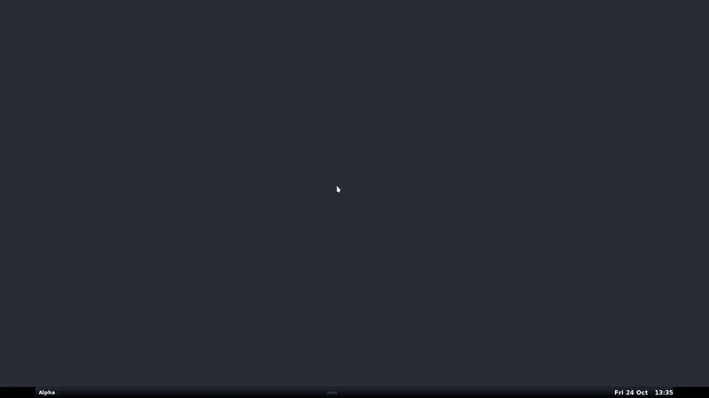

# yf.el


## 📝 Overview

`yf.el` is a DSL and a runtime for Emacs for multi-currency portfolio tracking. 

It's written in Emacs Lisp, with live price fetching from *Yahoo Finance*, memoized caching, and debug overlays.



`yf.el` includes a major mode, a REPL mode and interactive `elisp` functions. 

Its DSL uses a syntax similar to `Forth` and `Factor`.


## 💡 Example

```Forth
( Simple portfolio tracker and F.I.R.E calculator )
2500 EUR 12 * SET EXPENSE ( annual expense )

( Holdings USD )
$SBUX         300
$SCHD         3500
$QQQ          100
( Holdings EUR )
$SXR8.DE      750
$VWCE.DE      1800
$P911.DE      700

SUMPROD .S

[ TO EUR SHIFT ] DEPTH 1 - TIMES ( convert all to EUR )

SUM ?

EXPENSE / ANY ?

[ 25 > ] [ "You can retire now." ] [ "Keep working.." ] IF .
```

Evaluates your current holdings, converts them into your home currency, and divides by your annual expenses.

## ⚙️ Installation (Doom Emacs)

### packages.el

```elisp
(package! yf
  :recipe (:host github :repo "zeroflag/yahoo.emacs"))
```

### config.el
```elisp
(use-package! yf-mode :mode "\\.yf" :defer t)

(use-package! yf-repl
  :defer t
  :commands yf-repl-start
  :init
  (map! :leader
        :desc "Start Yahoo Finace REPL."
        "y s" #'yf-repl-start))
```

## 🔤 Words and Stack Effects

Below is the current word reference, grouped by category.

### 🌐 Yahoo Finance Integration

| Word                 | Stack Effect    | Description                                                                             |
| -------------------- | --------------- | --------------------------------------------------------------------------------------- |
| `$TICKER`            | `— → n`         | Fetches the price of a literal ticker symbol                                            |
| `PRICE`              | `s → n`         | Fetches the price of a ticker string                                                    |
| `TO`                 | `n → n`         | Converts an amount from its source currency to the target currency specified after `TO` |
| `XCHG`               | `n s → n`       | Sames as `TO` but instead of parsing the target currency it takes it from the stack     |

Examples:

```Forth
$AAPL .             => 180.25 USD
10 USD TO EUR .     => 8.61 EUR
10 USD "EUR" XCHG . => 8.61 EUR
```

All numbers are represented as dotted pairs in the form `(amount . CURRENCY)`, for example `(100.0 . "USD")`.
If no currency is specified, `"ANY"` is used by default.
Arithmetic operations can be performed between numbers that share the same currency, or when one of them has the `"ANY"` currency.

### 🔧 Core Stack Manipulation

| Word      | Stack Effect    | Description                                                           |
| --------- | --------------- | --------------------------------------------------------------------- |
| `DROP`    | `x →`           | Discards the top of the stack                                         |
| `DUP`     | `x → x x`       | Duplicates top element                                                |
| `OVER`    | `a b → a b a`   | Copies second element to top                                          |
| `SWAP`    | `a b → b a`     | Swaps top two elements                                                |
| `ROT`     | `a b c → b c a` | Rotates top three elements                                            |
| `-ROT`    | `a b c → c a b` | Inverse rotate                                                        |
| `TUCK`    | `a b → c a b`   | Copies the top of the stack and inserts it below the 2nd element      |
| `CLEAR`   | `... → `        | Clears the stack                                                      |
| `SHIFT`   | `... a → a ...` | Moves the top of the stack to the bottom                              |
| `DEPTH`   | `— → n`         | Pushes the current number of items on the stack onto the stack        |
| `SUMPROD` | `... → total`   | Multiplies each pairs then calculates the sum                         |
| `SUM`     | `... → total`   | Sums all numbers on the stack                                         |


```forth
100   $SBUX
250   $QQQ
500   $SPY

SUMPROD .
```

### 🧠 Logic & Control Flow

| Word      | Stack Effect                 | Description                                   |
| --------- | -----------------------------| --------------------------------------------- |
| `[`       | ` → NIL`                     | Startas defining a quotation until `]`        |
| `WHEN`    | `[cond] [then] →`            | Executes `then` quotation if `cond` is true   |
| `UNLESS`  | `[cond] [then] →`            | Executes `then` if `cond` evaluates false     |
| `IF`      | `[cond] [then] [else] →`     | Executes `then` if `cond` evaluates true      |
| `WHILE`	  | `[cond] [body] →`            | Executes `body` as long as `cond` is true     | 
| `UNTIL`   | `[body] [cond] →`            | Repeats `body` until `cond` becomes true      |
| `TIMES`   | `[quote] n →`                | Executes quotation `n` times                  |
| `CALL`    | `[quote] →`                  | Executes quotation                            |

Examples:

```forth
1 [ DUP 10 < ] [ 1 + ] WHILE

( convert all items on the stack to EUR )
[ TO EUR SHIFT ] DEPTH 1 - TIMES 

( select the minimum )
2 3 [ OVER OVER < ] [ DROP ] [ SWAP DROP ] IF

```

### 👷 Defining words

| Word      | Stack Effect                          | Description                                                                     |
| --------- | ------------------------------------- | ---------------------------------------------------------------- -------------- |
| `SET`     | `value →`                             | Defines a variable with the name specified after `SET`                          |
| `FORGE`   | `[quote] →`                           | Defines a word with the quotation as body, and the name specified after `FORGE` |

Examples
```forth
3.14 SET PI

[ 1 + ] FORGE INC

PI INC        => 4.14
```

### 🖨️ Output & Debugging

| Word     | Stack Effect   | Description                                                   |
| ---------| -------------- | ------------------------------------------------------------- |
| `PRINC`  | `x →`          | Pops and prints the top of the stack to stdout                |
| `MESSAGE`| `x →`          | Pops and prints the top of the stack to the message buffer    |
| `.`      | `x →`          | Pops and displays the top of the stack as an overlay          |
| `?`      | `x →`          | Displays the top of stack (without removing it) as an overlay |
| `.S`     | `— →`          | Displays current stack contents as an overlay                 |

## 📜 License

MIT License © 2025 — Attila Magyar

Use it freely, modify, and share — but please be kind to the Yahoo Finance API.
